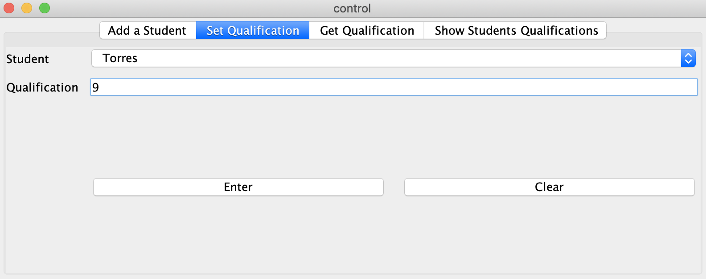

# Table of Contents

- [Proyect School Control With Java](#proyect-school-control-with-java)
  * [Purpose](#purpose)
  * [Proyect Requirements](#proyect-requirements)
  * [Software Requirements](#software-requirements)
  * [Definitions](#definitions)
    + [Bubble sort](#bubble-sort)
      - [Algorithm](#algorithm)
      - [Performance and Complexity](#performance-and-complexity)
    + [Hashtable](#hashtable)
      - [Example](#example)
    + [Sequential search](#sequential-search)
      - [Example](#example-1)
  * [How this proyect works?](#how-this-proyect-works)
    + [Login Window](#login-window)
      - [Login (Login Tab)](#login-login-tab)
      - [Login (Help Tab)](#login-help-tab)
    + [Control Window](#control-window)
      - [Add a Student (Tab)](#add-a-student-tab)
      - [Set Qualification (Tab)](#set-qualification-tab)
      - [Get Qualification (Tab)](#get-qualification-tab)
      - [Show Students Qualifications (Tab)](#show-students-qualifications-tab)
  * [How to run this proyect?](#how-to-run-this-proyect)
  * [Collaborators](#collaborators)

# Proyect School Control With Java

## Purpose

The purpose of this proyect is to have a simulation of a **School Control** with `Java` simulating the following parts:

- A fake database to consult the next things:
  - User's access to be able to see school control view
  - storage the user creation in a `Hashtable` 

## Proyect Requirements

The following requirements are needed in order to build this project:

- :mag_right: ​[Sequential search](https://github.com/PythonDarkeningSchool/estructuraDeDatos2/blob/master/src/control.java#L267-L280)
- :mag_right: ​[Bubble sort](https://github.com/PythonDarkeningSchool/estructuraDeDatos2/blob/master/src/control.java#L284-L318)
- [Hashtable](https://github.com/PythonDarkeningSchool/estructuraDeDatos2/blob/master/src/control.java#L29)

To see in which part of the code are being applied every single requirement click on the name of it.

## Software Requirements

In order to run this program you will need the following programs:

| Program | Download Link                                                | Icon                            |
| ------- | ------------------------------------------------------------ | ------------------------------- |
| Java    | [Download here](https://www.oracle.com/technetwork/java/javase/downloads/jdk8-downloads-2133151.html) |  |
| Git     | [Download here](https://git-scm.com/downloads)               |    |


## Definitions

### Bubble sort

**Bubble Sort** is a simple and slow sorting algorithm that repeatedly steps through the collection, compares each pair of adjacent elements and swaps them if they are in the wrong order. In the sorting algorithm, if you watch the move of the elements with higher orders (i.e. larger values), they are like bubbles in the water, floating slowly from the bottom to the top (from one side/middle of wrray to other side of array).

You can imagine that on every step big bubbles float to the surface and stay there. At the step, when no bubble moves, sorting stops.

#### Algorithm

The basic idea of Bubble Sort algorithm can be described as these steps:

1. Data elements are grouped into two sections: a sorted section and an un-sorted section.
2. Go through every element in the un-sorted section and re-arrange its position with its neighbor to put the element with higher order on the higher position. At the end, the element with the highest order will be on top of the un-sorted section, and moved to the bottom of the sorted section.
3. Repeat step 2 until no more elements left in the un-sorted section.


#### Performance and Complexity

1. Bubble sort belongs to O(n2) sorting algorithms, which makes it quite inefficient for sorting large data volumes.
2. Bubble sort is both **stable** and **adaptive**.
3. In the case of nearly sorted data, bubble sort takes O(n) time, but requires at least 2 passes through the data.
4. It can be practical if the input is usually in sort order but may occasionally have some out-of-order elements nearly in position.
5. Bubble sort should be avoided in the case of large collections.
6. It will not be efficient in the case of a reverse-ordered collection.

### Hashtable

This class implements a hash table, which maps keys to values. Any non-null object can be used as a key or as a value.
To successfully store and retrieve objects from a hashtable, the objects used as keys must implement the hashCode method and the equals method.

- It is similar to HashMap, but is synchronised.
- Hashtable stores key/value pair in hash table.
- In Hashtable we specify an object that is used as a key, and the value we want to associate to that key. The key is then hashed, and the resulting hash code is used as the index at which the value is stored within the table.

#### Example

```java
// creating a hash table 
Hashtable<Integer, String> h = new Hashtable<Integer, String>(); 
```

### Sequential search

Linear or sequential search algorithm is a method for finding a target value within a list.

It sequentially checks each element of the list for the target value until a match is found or until all the elements have been searched.

For a list with n items, the best case is when the value is equal to the first element of the list, in which case only one comparison is needed.

The worst case is when the value is not in the list (or occurs only once at the end of the list), in which case n comparisons are needed.

#### Example


## How this proyect works?

This proyect consist in two windows which are `login window` and `control window`

### Login Window

This window has two tabs that they will be explained here

#### Login (Login Tab)

In this tab the user will be able to login with a valid credentials


#### Login (Help Tab)

In this tab the user can see the credentials setup for this proyect


### Control Window

This window has 5 tabs which will be explained here

#### Add a Student (Tab)

In this tab the user will be able to insert students (*records*) in a **Hashtable** (simulating a small database)

This tab as well has some features (*restrictions*), e.g:

- The user can not insert a duplicate record


#### Set Qualification (Tab)

In this tab the user will be able to setup qualifications for the user in the **Hashtable**

This tab as well has some features (*restrictions*), e.g:

- If the user select this tab and there is not students in the **Hashtable** a warning message will appears and it will return you to `Add a Student` tab
- The user can enter only values from *1-10* as `Qualification`



#### Get Qualification (Tab)

In this tab the user can get the qualifications for the students, only if the users are in the **Hashtable**

This tab as well has some features (*restrictions*), e.g:

- If the user select this tab and there is not students in the **Hashtable** a warning message will appears and it will return you to `Add a Student` tab


#### Show Students Qualifications (Tab)

This tab has two buttons which the first one `Show Qualifications (Find Method)` is a way to get the qualifications in non orderer way, in fact the results are being show as the user put the data in the previous tabs:

- `Add a Student`
- `Set Qualification`


The second button shows the data in orderer way by `bubble sort method`


As well this tab has some features  (*restrictions*), e.g:

- If the user select this tab and there is not students in the **Hashtable** a warning message will appears and it will return you to `Add a Student` tab
- If the user select this tab and some student has not qualification a warning message will appears and it will return you to `Set Qualification` tab

## How to run this proyect?

Once you installed the Software Requirements for this proyect follow the next steps:

- 1. Open a terminal and clone the proyect with `git`

```bash
git clone https://github.com/PythonDarkeningSchool/estructuraDeDatos2.git
```


- 2. go to `estructuraDeDatos2/out/artifacts/proyect_jar`

```bash
cd estructuraDeDatos2/out/artifacts/proyect_jar
```


- 3. Execute the `Java` **jar file**

```bash
java -jar proyect.jar
```


 And that's it, enjoy it :+1:


## Collaborators

- :bust_in_silhouette: ​Humberto Israel Perez Rodriguez
- :bust_in_silhouette: ​Victor Hugo Robles Aguayo
- :bust_in_silhouette: ​Juan Carlos Navarro Borunda