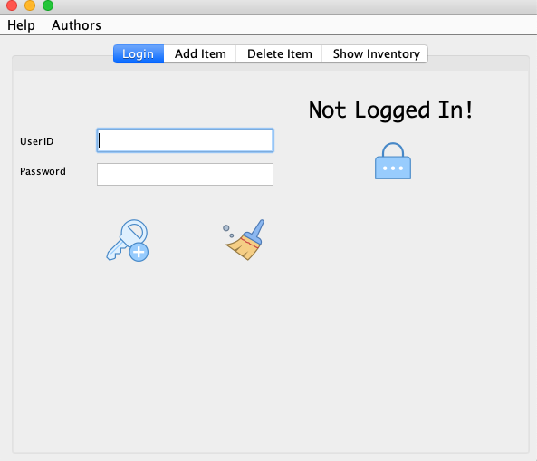
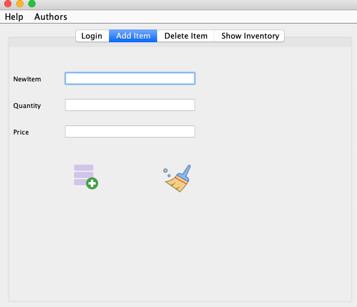
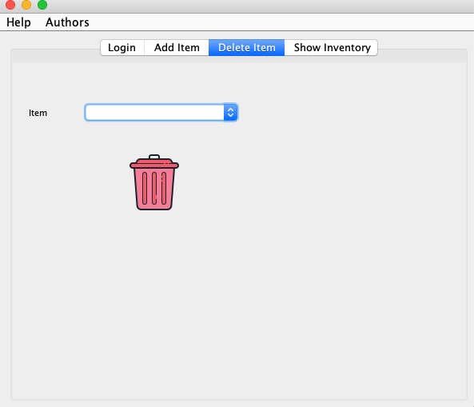
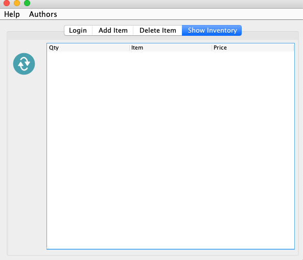

# Table of Contents

- [Project Inventory Control](#project-inventory-control)
  * [Concept](#concept)
  * [Software Requirements](#software-requirements)
  * [How to works this project?](#how-to-works-this-project)
    + [Login tab](#login-tab)
    + [Add Item Tab](#add-item-tab)
    + [Delete Item Tab](#delete-item-tab)
    + [Show Inventory Tab](#show-inventory-tab)
  * [How to run this project?](#how-to-run-this-project)
- [Collaborators](#collaborators)

# Project Inventory Control

## Concept

The main idea of this little proyect is to simulate a inventory control with user login and their database

## Software Requirements

| Program | Download Link                                                | Icon                  |
| ------- | ------------------------------------------------------------ | --------------------- |
| Java    | [Click here](https://www.oracle.com/technetwork/java/javase/downloads/jdk8-downloads-2133151.html) |  |
| Git     | [Click here](https://git-scm.com/downloads)                  |    |

## How to works this project?

### Login tab

In this window the user will be able to login with valid credentials, please click on `Help tab` to see the available credentials 



> Notice that this window has some animations when the user uses `admin` credentials

### Add Item Tab

In this window only the user logged as **admin** will be able to insert new items to the local database



### Delete Item Tab

In this window only the user logged as **admin** can delete items from the local database



### Show Inventory Tab

In this window **both** users (`admin & guest`) can show the inventory in the local database



## How to run this project?

- 1. Download the software requirements

- 2. Open a terminal and clone the proyect

  ```bash
  $ git clone https://github.com/PythonDarkeningSchool/estructuraDeDatos2.git
  ```

- 3. Go to the following path

  ```bash
  $ cd estructuraDeDatos2/inventoryControl/inventory/dist
  ```

- 4. Run the program

  ```
  $ java -jar inventory.jar
  ```

- Enjoy it :smiley:

# Collaborators

- :man: Humberto Israel Perez Rodriguez
- :man: Victor Hugo Robles Aguayo
- :man: Juan Carlos Navarro Borunda​